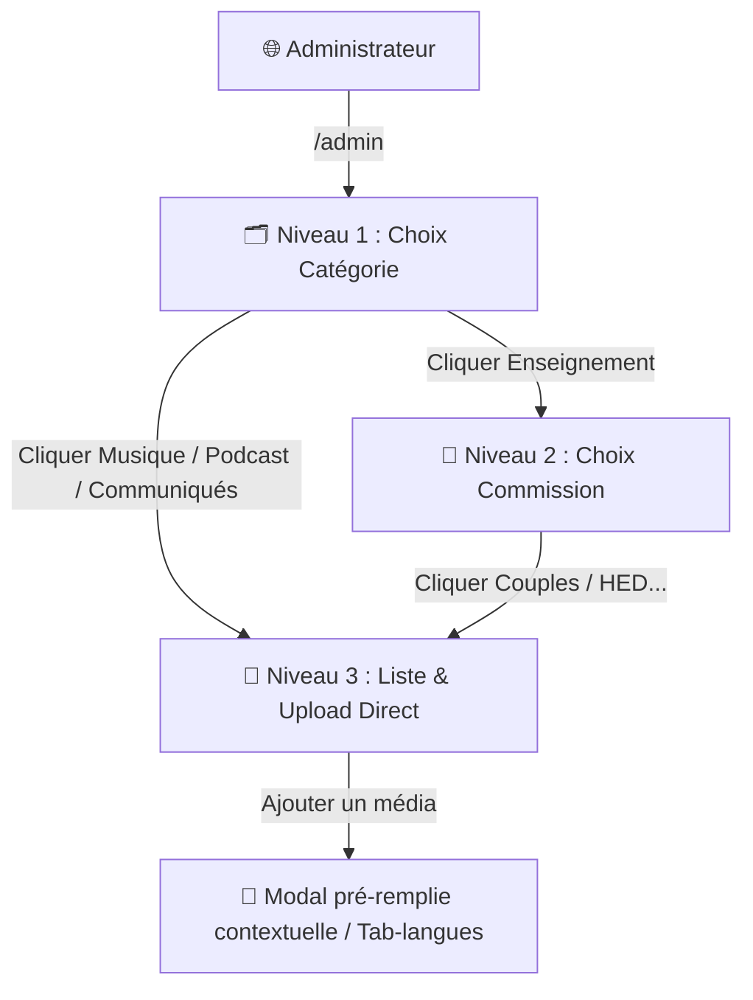

# 🎬 ImpactStream — Plateforme de Streaming

## Résumé

Plateforme locale de streaming vidéo et audio pour le Ministère Apostolique Impact, avec un design sombre premium inspiré de Netflix, harmonisé aux couleurs de l'église (orange et vert).

L'interface d'administration propose une navigation imbriquée logique :
1. **Niveau 1** : Sélection de la catégorie globale (Enseignements 📖, Musique 🎵, Podcasts 🎙️, Communiqués 📢).
2. **Niveau 2** : Sélection de la commission de destination (Uniquement pour les Enseignements : *Intercession, Couples, HED, Johana, Joseph, PDS, Culte, Nayoth*).
3. **Niveau 3** : Consultation et téléversement direct dans la section choisie.

## Architecture

---

## Fonctionnalités Admin Implémentées

### 🗂️ 1. Navigation Structurée & Intuitive
- **Entrée à plat** : Lors de la connexion à `/admin`, les quatre grands blocs de catégories sont visibles : Enseignements, Musiques, Podcasts et Communiqués.
- **Sélection des commissions d'enseignement** : Si l'utilisateur clique sur **Enseignements** (📖), un second écran de sélection apparaît avec les commissions (*Intercession, Couples, HED, Johana, Joseph, PDS, Culte, Nayoth*).
- **Consultation ciblée** : En cliquant sur une commission (ex: *Couples*), le tableau affiche uniquement les enseignements de cette commission.
- **Sécurité renforcée (Déconnexion automatique)** : 
  - Si l'administrateur quitte la zone d'administration (en retournant sur la page d'accueil `/` ou en fermant l'onglet/navigateur), la session admin est immédiatement détruite.
  - Tout nouvel accès à la zone d'administration demandera obligatoirement de saisir à nouveau le code secret (`Bungudi128`).
- **Routage des boutons retour** :
  - Depuis la gestion d'une commission d'enseignement ➔ retourne à l'écran des commissions.
  - Depuis la gestion de la musique, des podcasts ou des communiqués ➔ retourne à l'écran principal des catégories.

### 📝 2. Téléversement Simplifié (Champs Pré-remplis & Choix de Source)
- Dans la modal d'ajout, **les champs Catégorie et Commission ne sont plus visibles**. Ils sont gérés de manière transparente en arrière-plan à l'aide d'inputs cachés (`hidden`) qui récupèrent automatiquement le contexte actif (ex: Catégorie="Enseignement", Commission="Couples").
- **Double source supportée** : L'administrateur peut choisir la provenance du fichier média :
  - **Fichier local** : Importation de fichiers physiques stockés sur le Mac.
  - **Lien externe** : Intégration de liens URL directs (ex: liens publics Cloudflare R2, ou liens YouTube et Vimeo).
- Si un lien YouTube ou Vimeo est collé, le site public remplace automatiquement le lecteur vidéo natif par le lecteur interactif correspondant (Iframe) de manière transparente.
- L'utilisateur n'a qu'à saisir le titre, la description, la langue (optionnel) et uploader/coller les fichiers. Cela garantit une intégrité totale des données et évite les erreurs de catégorisation.

### 🔄 3. Restauration Automatique de Contexte (Flash Messages)
- Si un média ou un communiqué est ajouté, modifié ou supprimé, le serveur recharge la page `/admin` et affiche un message de notification (ex : "✅ Média ajouté avec succès !").
- Le code JavaScript détecte ce rechargement consécutif à une action et rouvre automatiquement la sous-section exacte (ex: Enseignement ➔ Couples, ou Communiqués) pour éviter à l'utilisateur de devoir recliquer sur tout le parcours. Si le rechargement est normal (ou sans flash), l'utilisateur repart de l'écran principal des catégories.

### 🖼️ 4. Affichage Dynamique des Miniatures
- Les miniatures téléversées s'affichent désormais sur toutes les cartes médias de la page d'accueil.
- La miniature du média mis en avant (Hero Banner) s'affiche comme fond d'écran géant avec un filtre sombre (comme sur Netflix).
- Les vidéos chargent également la miniature comme image de couverture (poster) avant le lancement de la lecture.

### 🧭 5. Sous-navigation par Rubrique (Espace Utilisateur)
- Dans l'espace utilisateur :
  - En cliquant sur **Enseignements** (📖) dans le menu, des pilules s'affichent pour : **Toutes, Intercession, Couples, HED, Johana, Joseph, PDS, Culte, Nayoth**.
  - En cliquant sur **Musique** (🎵) dans le menu, des pilules s'affichent pour : **Toutes, Adoration MP3, Adoration MP4, Nayoth, Chants PAB, Instrumentale**.
- En cliquant sur l'une de ces rubriques, les médias se filtrent instantanément.
- Cette barre de sous-navigation est masquée pour l'Accueil et les Podcasts.

### 🌐 6. Support Multi-langues (Français, Anglais, Espagnol, Néerlandais)
- **Côté Admin** : 
  - Lors de la création/modification d'un média, le Français (par défaut) peut être téléversé localement ou lié à une URL externe.
  - 3 champs optionnels ont été ajoutés pour renseigner des URLs externes en **Anglais**, **Espagnol** et **Néerlandais**.
- **Côté Utilisateur** :
  - Par défaut, le média se lance en Français.
  - Si d'autres langues ont été renseignées, un sélecteur dynamique apparaît sous le lecteur (ex : `🇫🇷 Français` | `🇳🇱 Néerlandais`).
- Cliquer sur une langue recharge le lecteur avec la source correspondante (YouTube, Vimeo, R2, etc.) de manière fluide, et met également à jour le bouton de téléchargement de fichier.

### 📝 7. Recherche par Paroles et Mots-clés
- **Côté Admin (Corrigé & Fonctionnel)** :
  - Un champ de saisie multi-lignes **"Paroles ou Mots-clés de recherche"** est disponible dans les formulaires de création et de **modification** de média.
  - *Correction apportée* : Un bug empêchait la sauvegarde des modifications apportées aux paroles/mots-clés ainsi qu'aux liens multilingues (anglais, espagnol, etc.) lors de l'édition d'un média existant. Les requêtes SQL de mise à jour (`UPDATE`) ont été corrigées pour enregistrer proprement ces champs en base de données.
- **Côté Utilisateur** :
  - La barre de recherche globale filtre désormais les médias non seulement sur le titre et la description, mais également sur l'ensemble des **paroles et mots-clés** saisis en arrière-plan.
  - Si un fidèle tape un mot du refrain ou un mot-clé spécifique, la chanson ou l'enseignement correspondant s'affichera instantanément !

### 👥 8. Module de Connexion, Inscriptions & Gestion Fine des Accès (Nayoth / Intercession)
- **Accès public sécurisé** : L'accès aux pages publiques d'ImpactStream (catalogue, lecture et téléchargement) est restreint. Tout utilisateur non authentifié est automatiquement redirigé vers la page `/login`.
- **Système d'Inscription intégré** : Les membres peuvent créer leur compte directement depuis l'onglet **Inscription** de la page de login, sous réserve d'utiliser une adresse du domaine `@ministereimpact.org`.
- **Permissions par défaut (Accès Restreint)** : À la création d'un compte, l'accès aux sections d'enseignements **Nayoth** et **Intercession** est **bloqué par défaut**. Les membres peuvent naviguer sur tout le reste de la plateforme, mais les enseignements de ces deux sections spécifiques sont invisibles pour eux (les filtres correspondants sont également masqués de leur barre de navigation).
- **Hachage sécurisé (Bcrypt/Werkzeug)** : Les mots de passe sont hachés de manière unidirectionnelle et sécurisée en base de données.
- **Gestion des Accès dans l'Administration** : 
  - Dans le menu **"Membres / Accès" 👥**, l'administrateur peut visualiser tous les comptes inscrits et gérer individuellement leurs droits d'accès à l'aide de commutateurs ON/OFF (toggles) interactifs pour **Nayoth** et **Intercession**.
  - L'activation ou la désactivation d'un droit se synchronise instantanément en arrière-plan (AJAX) sans recharger la page.
  - Le compte administrateur principal `yann.noukaze@ministereimpact.org` possède d'office tous les accès activés et sécurisés.
- **Sécurité Backend renforcée** : Les restrictions d'accès sont appliquées directement dans les requêtes SQL (serveur) afin de garantir qu'aucun utilisateur non autorisé ne puisse contourner l'interface pour charger les fichiers de Nayoth ou d'Intercession.

### 🎬 9. Écran d'Intro Animé Ultra-Fluide & Haute Résolution (WebP Image & Logo Reveal)
- **Conversion en Image Animée WebP** : Pour contourner définitivement les blocages d'autoplay imposés par les navigateurs modernes (Safari/Chrome) et supprimer le bouton de lecture "Play" imposé sur les fichiers vidéo, l'animation vidéo nettoyée du filigrane a été convertie programmatiquement en **WebP Animé** (`intro.webp`). 
- **Zéro Zoom & Zéro Perte de Qualité** : Comme le filigrane a été retiré directement du fichier média à l'aide de l'outil d'IA en ligne, **aucun zoom n'est appliqué (échelle 100%)**. La vidéo conserve toute sa définition d'origine (1080p Full HD upscalée).
- **Intégration sans restriction** : Les fichiers WebP animés étant traités comme de simples images par les navigateurs, l'animation se lance instantanément à l'écran dès le chargement de la page de manière 100% autonome et fluide, sans aucune interdiction ni superposition de contrôles.
- **Chronologie Stricte (JS Timer)** : Un minuteur JavaScript de 8,0 secondes (durée exacte de l'animation) synchronise la transition :
  1. À la 8e seconde, le logo officiel complet (avec son lettrage orange *"MINISTERE APOSTOLIQUE IMPACT"*) apparaît en fondu au centre.
  2. Le splash screen s'estompe délicatement pour révéler la page d'accueil d'ImpactStream.
- **Sauvegarde de Session** : L'intro ne se joue qu'**une fois par session** (mémoire `sessionStorage`) pour ne pas ralentir les saints lors de leur navigation.

### 🎟️ 10. Inscription sur Invitation Unique & Validation par E-mail
- **Génération d'Invitations (Admin)** :
  - L'administrateur peut générer des jetons d'invitation sécurisés uniques pour des adresses e-mail du domaine `@ministereimpact.org` depuis l'onglet **Membres / Accès** de l'administration.
  - Le système produit un lien unique du type `/login?view=register&token=<invite_token>` qui peut être copié dans le presse-papiers d'un simple clic.
  - Les invitations actives sont listées dans un tableau dédié ("Générer des Liens d'Inscription") avec leur statut (*Disponible* ou *Consommé*).
- **Vérification du Jeton à l'Inscription** :
  - Tout accès à l'onglet d'inscription `/login?view=register` est bloqué et renvoie vers la connexion s'il n'y a pas de jeton d'invitation actif fourni.
  - Si le jeton est valide, l'onglet s'ouvre avec l'adresse e-mail pré-remplie et verrouillée en lecture seule (`readonly`) pour empêcher toute usurpation.
- **Validation Double Opt-In par E-mail** :
  - À la soumission, l'invitation est marquée comme consommée (`used = 1`) et le compte est créé en attente d'activation (`is_verified = 0`).
  - Un e-mail d'activation est simulé localement dans `static/emails/activation_<email>.txt` et un lien clickable est affiché sous forme d'alerte verte.
  - L'utilisateur clique sur le lien d'activation `/verify-email?token=...` pour valider son e-mail. Le compte passe alors au statut actif (`is_verified = 1`) et il peut se connecter.
  - Tenter de se connecter sans avoir validé l'e-mail affiche un message d'erreur clair avec la possibilité de l'activer directement.

### 📢 11. Système de Communiqués Dominicales Multilingues
- **Côté Admin** :
  - Un nouveau bouton et une nouvelle carte de catégorie **"Communiqués"** dans le tableau de bord d'administration.
  - La gestion complète des communiqués (Listing, Création, Modification, Suppression).
  - Un formulaire de publication avec des **onglets de langues (🇫🇷 Français, 🇬🇧 Anglais, 🇪🇸 Espagnol, 🇳🇱 Néerlandais, 🇨🇩 Lingala)** pour un copier-coller extrêmement rapide et soigné.
- **Côté Utilisateur** :
  - Un nouvel onglet **"Communiqués"** dans la barre de navigation.
  - Un affichage interactif sous forme de timeline à gauche (les différents dimanches) et de cartes de contenu sur la droite.
  - Un **sélecteur de langue à la volée** (FR, EN, ES, NL, LN) pour chaque communiqué avec une transition fluide en fondu CSS.
  - Une **liseuse plein écran (modal dédiée)** pour un confort de lecture optimal.
- **Validation** :
  - Script de test d'intégration `test_communiques.py` qui valide les endpoints Flask et les structures SQL associées.

---

## Comment tester en local

### 1. Gestion des Médias
1. Ouvrez l'administration : [http://127.0.0.1:5000/admin](http://127.0.0.1:5000/admin) (code `Bungudi128`).
2. Vous arrivez sur les 4 grands blocs : *Enseignements*, *Musique*, *Podcasts*, *Communiqués*.
3. Cliquez sur **Enseignements** ➔ Vous voyez la liste des commissions.
4. Cliquez sur **Couples** ➔ Vous voyez la table contenant les enseignements de la commission *Couples*.
5. Cliquez sur **"Ajouter dans Couples"** ➔ Remplissez les champs et ajoutez votre vidéo. Elle s'insère automatiquement dans la bonne section.

### 2. Invitations & Inscriptions
1. Allez dans l'administration ➔ Cliquez sur **Membres / Accès** 👥.
2. Saisissez une adresse e-mail (ex: `saint.test@ministereimpact.org`) dans la section **Générer des Liens d'Inscription** et validez.
3. Cliquez sur le bouton **Copier** à côté du lien généré dans la table des invitations.
4. Ouvrez ce lien dans un onglet (ou déconnectez-vous pour le tester). L'onglet Inscription s'ouvre, l'e-mail est pré-rempli et verrouillée.
5. Saisissez un mot de passe (ex: `password123`) et validez.
6. Cliquez sur le lien d'activation simulé dans l'alerte de confirmation verte pour activer le compte.
7. Connectez-vous avec `saint.test@ministereimpact.org` et `password123` ➔ Vous accédez à la plateforme !
8. Allez dans l'administration ➔ Le compte apparaît maintenant sous le statut **Actif** et vous pouvez lui attribuer l'accès à *Nayoth* ou *Intercession*.

### 3. Communiqués Dominicales
1. Allez dans l'administration ➔ Cliquez sur **Communiqués** 📢.
2. Cliquez sur **Créer un communiqué** ➔ Remplissez le titre et collez le contenu dans les onglets de langues (ex: Français, Lingala).
3. Connectez-vous sur l'espace public ➔ Cliquez sur **Communiqués** dans la barre de navigation.
4. Vous voyez la timeline des dimanches à gauche. Sélectionnez le dimanche pour charger l'annonce.
5. Cliquez sur les pilules de langues sous le titre pour alterner de version, et cliquez sur **Lire en plein écran** pour l'ouvrir dans la liseuse immersive.

### 4. Résolution du Gel des Confettis
1. Lancez un jeu (ex: *Morpion (OXO)* ou *Jeu de Mémoire Biblique*).
2. Complétez le jeu pour remporter la victoire.
3. Les confettis tombent de manière fluide pendant 6 secondes.
4. À la fin de l'animation (ou si vous relancez le jeu immédiatement via le bouton **Recommencer**), le canevas est vidé programmatiquement (`ctx.clearRect`).
5. Les confettis disparaissent instantanément, libérant totalement l'écran sans nécessiter de recharger la page.

### 5. Résolution du Chevauchement Séries/Espaces
1. Naviguez sur l'onglet **Enseignements** ➔ Le carrousel de playlists (séries) s'affiche correctement en haut de l'écran.
2. Cliquez sur l'onglet **Espaces** (ou d'autres rubriques comme *Communiqués*, *Bible*, *Radio*, *Directs*) ➔ Le carrousel des séries de l'onglet précédent est masqué instantanément.
3. Seuls la grille des espaces ministériels ou les outils associés s'affichent à l'écran, supprimant tout chevauchement ou bruit visuel.

### 6. Palette de Surlignage Multi-Couleurs de la Bible
1. Naviguez sur l'onglet **Bible** ➔ Sélectionnez un livre et un chapitre.
2. Cliquez sur un verset ➔ Une palette flottante avec 5 couleurs de surlignage (Orange, Jaune, Vert, Bleu, Rose) et une gomme s'affiche au-dessus du verset.
3. Sélectionnez une couleur pour surligner instantanément le verset. La couleur choisie est enregistrée et conservée d'une session à l'autre.
4. Cliquez de nouveau sur le verset (ou sélectionnez la gomme 🗑️) pour supprimer le surlignage.

### 7. Surlignage Multi-Couleurs des Communiqués
1. Naviguez sur l'onglet **Communiqués** ➔ Cliquez sur un communiqué pour l'ouvrir.
2. Cliquez sur un paragraphe du communiqué ➔ Une palette flottante avec les 5 couleurs de surlignage et la gomme s'affiche au-dessus du paragraphe.
3. Sélectionnez une couleur pour surligner le paragraphe. L'état est stocké dans le stockage local et réactivé automatiquement.
4. Cliquez de nouveau sur le paragraphe (ou utilisez la gomme ✕) pour effacer le surlignage.

